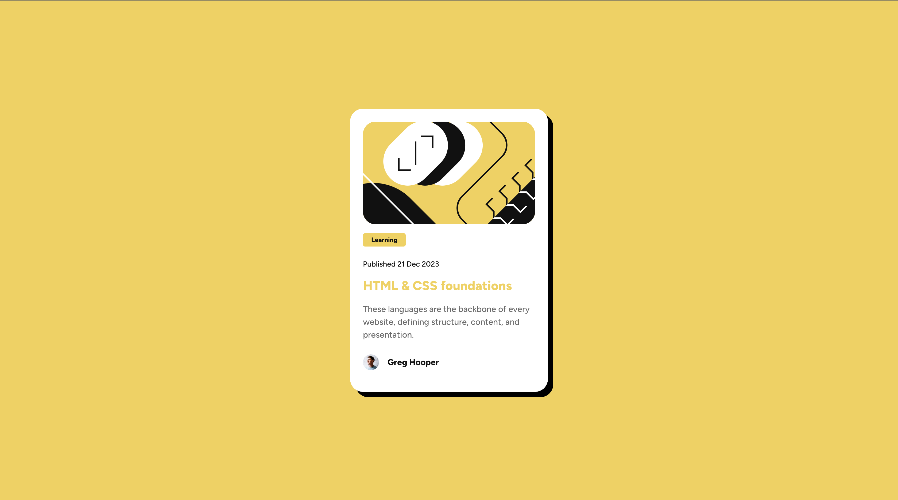

# Frontend Mentor - Blog preview card solution

This is a solution to the [Blog preview card challenge on Frontend Mentor](https://www.frontendmentor.io/challenges/blog-preview-card-ckPaj01IcS).

## Table of contents

- [Overview](#overview)
  - [Screenshot](#screenshot)
  - [Links](#links)
- [My process](#my-process)
  - [Built with](#built-with)
  - [What I learned](#what-i-learned)
  - [Continued development](#continued-development)
  - [Useful resources](#useful-resources)
- [Author](#author)

## Overview

### Screenshot



### Links

- Live Site URL: <a href="https://frontend-mentor-blog-preview-cardb8629.web.app/" target="_blank">Click Here</a>

## My process

### Built with

- HTML5
- CSS
- CSS Flex
- CSS Grid
- Hosting - Firebase

### What I learned

I learnt about CSS Media Queries and how to use them effectively and how to make websites responsive to different screen size. Even though I used media queries i still am new to this area and need more practice to get better at it. Additionally, I delved into CSS Flexbox, a layout model that provides me with a more efficient way to distribute space and align content within a container.

```css
@media (max-width: 375px) {
	.container {
		background-color: var(--clr-card-100);
		display: flex;
		flex-direction: column;

		padding: 1.5rem;
		width: 325px;
		height: 530px;
		border-radius: 1.5rem;

		box-shadow: 10px 10px 0px black;
	}
}
```

### Continued development

In future projects, I want to learn more about semantics and make my code more readable and maintainable. I also want to learn more about CSS Grid and how to use it effectively. I want to learn more about responsive design and how to make my websites responsive. I also want to learn more about JavaScript and how to use it in my projects. I also want to learn how to use CSS properties and values effectively.

### Useful resources

- <a href="https://css-tricks.com/snippets/css/a-guide-to-flexbox/" target="_blank">Flexbox</a> - This helped me understand and how to use flex.
- <a href="https://developer.mozilla.org/en-US/docs/Web/HTML" target="_blank">Learning HTML</a> - This website helped me understand different tags and elemetns in HTML.
- <a href="https://developer.mozilla.org/en-US/docs/Web/CSS" target="_blank">Learning CSS</a> - This website helped me understand different properties and values in CSS.
- <a href="https://developer.mozilla.org/en-US/docs/Web/CSS/CSS_media_queries/Using_media_queries" target="_blank">Learning Media Queries</a> - This website helped me understand how to use media queries in CSS.

## Author

- Linkedin - [Jaweed Inayathulla](https://www.linkedin.com/in/jaweedinayathulla/)
- Frontend Mentor - [@InaJaweed](https://www.frontendmentor.io/profile/InaJaweed)
